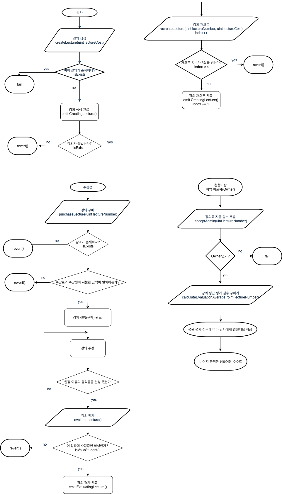

# # 청출어람 Smart Contract

## # Development Environment

* Solidity 0.4.24
* [Remix](http://remix.ethereum.org/#optimize=true&version=soljson-v0.4.25+commit.59dbf8f1.js)
* [Klaytn Aspen Network](https://www.klaytn.com/)

## # Flow Chart

계약 참여자를 강사(농부), 수강생, 청출어람(Owner) 세 부류로 나눌수 있습니다.

